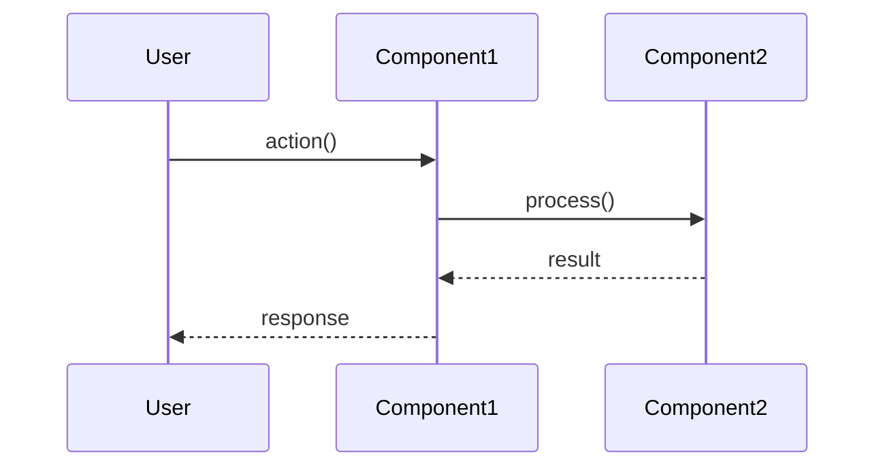

# Gemini 오픈소스 분석 가이드 (v2.0)

> 이 문서는 Gemini에게 오픈소스 프로젝트를 "문제 → 고민 → 해결" 관점으로 분석시키기 위한 범용 프롬프트입니다.
>
> **적용 가능 프로젝트**: Android, 웹(React/Vue/Django), Python, dbt, Kafka 등 모든 타입

---

## 🎯 분석 목표

단순히 "무엇을 하는가?"를 넘어서, 다음 질문에 답하기:

1. **왜 이 구조를 선택했는가?** (아키텍처 결정)
2. **어떤 문제를 해결하기 위한 것인가?** (설계 의도)
3. **어떻게 상호작용하는가?** (데이터 흐름)
4. **실제로 어떻게 사용하는가?** (사용 패턴)
5. **어떤 한계가 있고, 어떻게 개선할 수 있는가?** (현실적 평가)

---

## ⏱️ Phase별 우선순위 및 시간 배분

**전체 분석 시간이 제한적일 때 우선순위**:

### 필수 (Must Have)
- **Phase 0**: 아키텍처 요약 (1시간) - `00_ARCHITECTURE_SUMMARY.md`
- **Phase 1**: 핵심 파일 선정 (30분)
- **Phase 2**: 핵심 파일 분석 5-10개 (3-4시간)
- **Phase 5**: 종합 요약 (30분)

### 권장 (Should Have)
- **Phase 3**: 실행 흐름 분석 3-5개 (2시간) - `FLOW_*.md`

### 선택 (Nice to Have)
- Phase 2에서 추가 파일 분석
- 성능 프로파일링 상세 분석

**총 권장 시간**: 5-8시간 (핵심만 집중)

---

## 📋 Phase 0: 아키텍처 전체 요약 (신규 추가!)

**가장 먼저 작성**: `00_ARCHITECTURE_SUMMARY.md`

### 목적
프로젝트의 전체 그림을 한눈에 파악할 수 있는 요약 문서

### 필수 포함 내용

#### 1. 프로젝트 개요
```markdown
## 📚 프로젝트 개요
- **프로젝트**: [프로젝트명]
- **저장소**: [GitHub URL]
- **목적**: **[한 문장으로 핵심 목적 설명]**
- **특징**: [주요 특징 1-2개]
```

**예시**:
- vanna: "자연어를 SQL로 변환하는 RAG 기반 Text-to-SQL 프레임워크"
- aiokafka: "순수 Python asyncio 기반 Kafka 클라이언트 (librdkafka 없이 Wire Protocol 직접 구현)"

#### 2. 핵심 문제와 해결 (3-5개)

**템플릿**:
```markdown
## 🎯 핵심 문제와 해결

### 문제 1: [문제 제목]
**Before**: [기존 방식의 문제점]
- ❌ 문제점 1
- ❌ 문제점 2

**After**: [프로젝트가 제시한 해결책]
- ✅ 해결 1
- ✅ 해결 2

**핵심 아이디어**:
[간단한 코드 또는 다이어그램]
```

**예시 (vanna)**:
```markdown
### 문제 1: Text-to-SQL의 근본적 한계
**Before**: Fine-tuning으로 SQL 생성
- ❌ 스키마 변경 시 재학습 필요
- ❌ 비용 높음

**After**: RAG (Retrieval-Augmented Generation)
- ✅ 스키마 변경 즉시 반영
- ✅ Few-shot learning

**핵심 아이디어**:
질문 → Vector Search (유사 SQL) → LLM Prompt → SQL 생성
```

#### 3. 전체 계층 구조

**ASCII 다이어그램 또는 Mermaid**:
```markdown
## 🏛️ 전체 계층 구조

```
┌──────────────────────────────────────┐
│  User Application                     │
└────────────┬─────────────────────────┘
             │
┌────────────┴─────────────────────────┐
│  High-Level API Layer                │
└────────────┬─────────────────────────┘
             │
┌────────────┴─────────────────────────┐
│  Core Logic Layer                    │
└────────────┬─────────────────────────┘
             │
┌────────────┴─────────────────────────┐
│  Infrastructure Layer                │
└──────────────────────────────────────┘
```
```

#### 4. 주요 모듈 상세

```markdown
## 📂 주요 모듈 상세

### 🔹 **[모듈명]** ([파일명])
**역할**: [한 문장 설명]

**핵심 기능**:
- 기능 1
- 기능 2

**특징**:
- ✅ 장점 1
- ✅ 장점 2
```

#### 5. 핵심 설계 패턴

```markdown
## 🎨 핵심 설계 패턴

### 1. **[패턴명]** ([목적])
**구현**:
[간단한 코드 스니펫]

**적용**:
- 사용처 1
- 사용처 2
```

#### 6. 요약 테이블

```markdown
## 📝 요약

| 측면 | 내용 |
|------|------|
| **핵심 목적** | [한 문장] |
| **주요 문제** | [3가지] |
| **해결 방법** | [3가지] |
| **핵심 패턴** | [3가지] |
| **확장성** | [어떻게 확장 가능한가] |

**한 줄 요약**: [프로젝트 전체를 한 문장으로]
```

---

## 📋 Phase 1: 핵심 파일 선정

### 🎯 핵심 파일 선정 기준

**중요**: 모든 파일을 분석하지 마세요! 5-10개만 선정하세요.

#### ✅ 분석 필수 파일

**1. 아키텍처 핵심**
- 프로젝트의 설계 패턴을 정의하는 파일
- 판단 기준: 10개 이상의 파일이 의존하는가?
- 예시: `BaseViewModel.kt`, `Repository.kt`, `VannaBase.py`

**2. 보안/성능 중요**
- 보안, 성능, 안정성에 직접 영향
- 판단 기준: 버그 시 심각한 문제 발생하는가?
- 예시: `TokenAuthenticator.kt`, `Connection.py`, `SecurityUtils.kt`

**3. 복잡한 비즈니스 로직**
- 도메인 로직이 복잡하거나 중요
- 판단 기준: 함수가 50줄 이상이고 조건문/반복문이 많은가?
- 예시: 결제 처리, 인증 로직, RAG 파이프라인

**4. 재사용 빈도 높은 유틸리티**
- 프로젝트 전역에서 사용
- 판단 기준: 20개 이상의 파일에서 import 하는가?
- 예시: `Utils.kt`, `Extensions.kt`, `types.py`

#### ❌ 분석 생략 가능 파일

**1. 단순 데이터 모델 (DTO)**
- 비즈니스 로직 없이 데이터만 담는 클래스
- 예외: 복잡한 변환 로직이 있으면 분석

**2. UI 어댑터**
- RecyclerView Adapter 같은 반복적인 패턴
- 예외: 커스텀 로직이 많으면 분석

**3. 일회성 화면**
- 단순 화면 표시만 하는 UI
- 예외: 복잡한 상태 관리가 있으면 분석

**4. 테스트 파일**
- 초기 분석에서는 제외

#### 🔍 빠른 선정 방법 (범용)

**의존성이 많은 파일 찾기**:
```bash
# Python/JavaScript
rg "import.*[파일명]" --stats | head -20

# Kotlin/Java
grep -r "import.*[클래스명]" --include="*.kt" | wc -l

# TypeScript/React
rg "from.*'.*[파일명]'" --stats
```

**복잡도가 높은 파일 찾기**:
```bash
# 라인 수 기준
find src -name "*.py" | xargs wc -l | sort -rn | head -20
find src -name "*.kt" | xargs wc -l | sort -rn | head -20
find src -name "*.ts" | xargs wc -l | sort -rn | head -20
```

**최근 수정 빈도가 높은 파일**:
```bash
git log --format= --name-only --since="6 months ago" | sort | uniq -c | sort -rn | head -20
```

#### 📊 선정 기준표 (정량적)

| 기준 | 가중치 | 점수 계산 |
|-----|--------|---------|
| 의존성 개수 | 40% | 10개 이상 = 10점 |
| 복잡도 (라인 수) | 30% | 200줄 이상 = 10점 |
| 보안/성능 중요도 | 20% | 주관적 판단 |
| 수정 빈도 | 10% | 최근 3개월 5회 이상 = 10점 |

**총점 7점 이상 → 필수 분석**

### Gemini 프롬프트 (1단계)

```
나는 오픈소스 프로젝트를 "문제 → 고민 → 해결" 관점으로 분석하려고 합니다.

# 작업 1: 아키텍처 전체 요약 작성

먼저 `00_ARCHITECTURE_SUMMARY.md` 파일을 작성해주세요.

## 필수 포함 내용:
1. 프로젝트 개요 (목적, 특징)
2. 핵심 문제와 해결 (3-5개)
   - Before/After 구조
   - 핵심 아이디어
3. 전체 계층 구조 (다이어그램)
4. 주요 모듈 상세 (3-5개)
5. 핵심 설계 패턴 (3-5개)
6. 요약 테이블

---

# 작업 2: 핵심 파일 목록 작성

[프로젝트명] 프로젝트의 **핵심 파일 5-10개**를 선정해주세요.

## 선택 기준:
### ✅ 분석 필수 파일
- 아키텍처 핵심 (10개 이상 파일이 의존)
- 보안/성능 중요 (버그 시 심각)
- 복잡한 비즈니스 로직 (50줄+ 복잡 함수)
- 재사용 빈도 높음 (20개+ 파일에서 import)

### ❌ 분석 생략 가능
- 단순 데이터 모델 (DTO)
- UI 어댑터 (반복 패턴)
- 일회성 화면
- 테스트 파일

### 📊 정량적 기준
| 기준 | 가중치 | 점수 |
|-----|--------|------|
| 의존성 | 40% | 10개 이상 = 10점 |
| 복잡도 | 30% | 200줄 이상 = 10점 |
| 중요도 | 20% | 주관적 판단 |
| 수정 빈도 | 10% | 3개월 5회+ = 10점 |

**총점 7점 이상만 선정**

## 출력 형식:
선정된 핵심 파일 (5-10개):

1. `파일경로/filename.py` - 역할 (약 XXX lines)
   - 의존성: XX개 파일 / 복잡도: XXX줄 / 점수: X/10
   - 선정 이유: [한 줄]

2. ...

---

# 작업 3: 첫 번째 파일 분석 시작

위에서 선택한 **첫 번째 파일**을 분석해주세요.

## 📖 분석 방법론

반드시 첨부된 파일들을 참고하세요:
1. **ANALYSIS_METHODOLOGY.md** - 분석 방법론
2. **aiokafka/analysis-v2/conn.py.md** - 분석 예시 1
3. **aiokafka/analysis-v2/client.py.md** - 분석 예시 2
4. **aiokafka/analysis-v2/cluster.py.md** - 분석 예시 3

[파일 내용 첨부]

## 필수 포함 섹션:

### 1. 📋 파일 개요
- 파일 정보 (경로, 줄 수, 주요 클래스)
- 핵심 역할 (한 문장)
- 누가 사용하는가?

### 2. 해결하는 핵심 문제들
각 문제마다:
- **문제**: 어떤 문제를 해결하려고 하는가?
- **고민했던 선택지**: Option A/B/C (장단점)
- **최종 해결책**: 구조, 코드 예시, 트레이드오프

### 3. ⭐ 실전 적용 가이드 (최소 4개)
- 상황: 언제 사용?
- Step 1-3: 구현 방법 (복사 가능한 코드)
- 체크리스트 (표 형식)

### 4. ⭐ 안티패턴과 흔한 실수 (최소 7개)
- ❌ 나쁜 예 (코드)
- 문제점
- ✅ 좋은 예 (코드)

### 5. ⭐ 스케일 고려사항 (소/중/대)
- 권장 사항 (✅/⚠️)
- 구현 예시 (코드)
- 모니터링 방법

### 6. 배운 점 (7-8개)
- 개념 + 언제 사용 + 적용처

### 7. 요약 (표 형식)

## 출력 파일명:
`[첫번째파일명].md`

---

분석 완료 후:
"✅ [파일명].md 분석 완료. 다음 파일을 분석하려면 '다음 파일 분석해줘'라고 요청하세요."
```

---

## 📋 Phase 2: 파일 단위 분석

### 2단계: 나머지 파일 순차 분석

```
다음 파일 분석해줘
```

이를 반복하여 선정된 모든 핵심 파일 분석 (5-10개)

---

## 📋 Phase 3: 실행 흐름 분석 (신규 추가!)

**목적**: 정적 분석만으로는 부족. 실제 실행 시 어떻게 동작하는가?

### 핵심 실행 시나리오 식별

**프로젝트 타입별 예시**:

#### Android 앱
1. 앱 시작 (Cold Start)
2. 로그인 흐름
3. 데이터 조회
4. 토큰 갱신
5. 푸시 알림 처리

#### 웹 애플리케이션
1. 서버 시작 (`npm start`)
2. API 요청 처리
3. 인증 미들웨어
4. 데이터베이스 쿼리

#### Python 라이브러리 (vanna)
1. SQL 생성 과정 (`generate_sql()`)
2. 학습 과정 (`train()`)
3. 토큰 갱신 (`TokenAuthenticator`)

#### dbt 프로젝트
1. `dbt run`
2. `dbt test`

### FLOW 문서 작성 가이드

각 핵심 시나리오마다 `FLOW_[시나리오명].md` 생성

**템플릿**:
```markdown
# [시나리오명] 실행 흐름

## 입력 (Input)
- 사용자 액션 또는 트리거
- 초기 상태

## 처리 과정 (Process)

### 시퀀스 다이어그램


### 단계별 설명
1. **Step 1**: [설명]
   ```언어
   // 실제 코드
   ```

2. **Step 2**: [설명]
   ...

## 출력 (Output)
- 최종 결과
- 부작용 (side effects)

## 성능
- 실행 시간: XX ms
- 병목 지점: [어디]
```

### Gemini 프롬프트 (Phase 3)

```
이제 실행 흐름을 분석하겠습니다.

# 작업: 핵심 실행 시나리오 분석

[프로젝트명]의 **핵심 실행 시나리오 3-5개**를 선정하고,
각각 `FLOW_[시나리오명].md` 문서를 작성해주세요.

## 시나리오 선정 기준:
- 사용자가 가장 자주 사용하는 기능
- 시스템의 핵심 동작
- 여러 모듈이 협력하는 복잡한 흐름

## 각 시나리오마다 포함:

### 1. 입력 (Input)
- 사용자 액션 또는 트리거
- 초기 상태

### 2. 처리 과정 (Process)
- **Mermaid 시퀀스 다이어그램** (필수!)
- 단계별 설명 + 실제 코드 스니펫

### 3. 출력 (Output)
- 최종 결과
- 부작용 (DB 저장, 상태 변경 등)

### 4. 성능 분석 (선택)
- 실행 시간
- 병목 지점

## 예시 시나리오:

### Android 앱
- FLOW_APP_START.md - 앱 시작
- FLOW_LOGIN.md - 로그인
- FLOW_TOKEN_REFRESH.md - 토큰 갱신

### Python 라이브러리
- FLOW_GENERATE_SQL.md - SQL 생성
- FLOW_TRAINING.md - 학습
- FLOW_ASK.md - 전체 파이프라인

### 웹 서버
- FLOW_SERVER_START.md - 서버 시작
- FLOW_REQUEST_HANDLING.md - 요청 처리
- FLOW_AUTHENTICATION.md - 인증

---

첫 번째 FLOW 문서를 작성해주세요.
```

---

## 💡 범용 팁

### Gemini에게 첨부해야 할 파일
1. **ANALYSIS_METHODOLOGY.md** (방법론)
2. **aiokafka/analysis-v2/conn.py.md** (예시 1)
3. **aiokafka/analysis-v2/client.py.md** (예시 2)
4. **aiokafka/analysis-v2/cluster.py.md** (예시 3)
5. **vanna/analysis/00_ARCHITECTURE_SUMMARY.md** (아키텍처 요약 예시)

### ⚠️ 파일이 너무 클 때 (2000줄 이상)

**문제**: Output Token Limit (32000) 에러 발생 가능

**해결책**: 기능별로 Part 분할

**예시 - vanna/base.py (2118줄)**:
```
Part 1: RAG Workflow (lines 93-382)
- 파일명: base.py-part1-rag.md

Part 2: Abstraction Layer (lines 383-693)
- 파일명: base.py-part2-abstraction.md

Part 3: Database Connections (lines 761-1682)
- 파일명: base.py-part3-database.md

Part 4: High-level API (lines 1683-2118)
- 파일명: base.py-part4-highlevel-api.md
```

**진행 순서**:
1. 파일 전체를 읽고 기능별로 Part 나누기
2. Part 1-4 순차 분석
3. (선택) 전체 요약 문서

**각 Part별 필수 포함**:
- 해당 Part의 핵심 문제
- 실전 가이드 (최소 2개)
- 안티패턴 (최소 3개)
- 핵심 학습

---

## 📋 Phase 4: 종합 요약

### `_ANALYSIS_SUMMARY.md` 작성

**목적**: 모든 분석을 종합한 최종 문서

**템플릿**:
```markdown
# [프로젝트명] 분석 종합

## 핵심 아키텍처 결정 (3-5개)

### 1. [결정 제목]
**이유**: [왜 이 방식을 선택했나]
**효과**: [어떤 이점이 있나]
**트레이드오프**: [무엇을 희생했나]

## 분석 문서 링크

### 아키텍처 요약
- [00_ARCHITECTURE_SUMMARY.md](./00_ARCHITECTURE_SUMMARY.md)

### 정적 분석 (파일별)
- [파일1.md](./파일1.md) - 역할
- [파일2.md](./파일2.md) - 역할
...

### 동적 분석 (실행 흐름)
- [FLOW_시나리오1.md](./FLOW_시나리오1.md)
- [FLOW_시나리오2.md](./FLOW_시나리오2.md)
...

## 가장 흥미로운 설계 결정 3가지

### 1. [제목]
**문제**: [무엇이 문제였나]
**해결**: [어떻게 해결했나]
**인사이트**: [무엇을 배웠나]

## 실행 흐름 인사이트 (Phase 3에서 발견한 것)

### 성능 특성
- [시나리오1]: XX ms (병목: [어디])
- [시나리오2]: XX ms

### 최적화 여지
- [개선점 1]
- [개선점 2]
```

### Gemini 프롬프트 (Phase 4)

```
모든 분석을 종합해서 `_ANALYSIS_SUMMARY.md`를 작성해주세요.

## 포함 내용:

1. **핵심 아키텍처 결정** (3-5개)
   - 이유, 효과, 트레이드오프

2. **분석 문서 링크**
   - 아키텍처 요약
   - 정적 분석 (파일별)
   - 동적 분석 (실행 흐름)

3. **가장 흥미로운 설계 결정 3가지**
   - 문제, 해결, 인사이트

4. **실행 흐름 인사이트**
   - 성능 특성
   - 병목 지점
   - 최적화 여지

---

완료 후:
"✅ _ANALYSIS_SUMMARY.md 작성 완료. 모든 분석이 끝났습니다."
```

---

## 📊 분석 체크리스트

### Phase 0: 아키텍처 요약
- [ ] `00_ARCHITECTURE_SUMMARY.md` 작성 완료
- [ ] 프로젝트 개요 명확히 정의
- [ ] 핵심 문제 3-5개 식별
- [ ] 전체 계층 구조 다이어그램
- [ ] 주요 모듈 설명
- [ ] 핵심 설계 패턴 정리

### Phase 1: 핵심 파일 선정
- [ ] 정량적 기준으로 5-10개 파일 선정
- [ ] 선정 이유 명시 (의존성/복잡도/중요도/수정빈도)
- [ ] 생략한 파일도 기록 (왜 생략했는지)

### Phase 2: 파일 분석
선정된 각 파일에 대해:
- [ ] 핵심 역할 1문장 요약
- [ ] 문제 → 고민 → 해결 구조
- [ ] 실전 가이드 4개 이상
- [ ] 안티패턴 7개 이상
- [ ] 스케일 고려사항 (소/중/대)
- [ ] 배운 점 7-8개
- [ ] 요약 테이블

### Phase 3: 실행 흐름
- [ ] 핵심 시나리오 3-5개 식별
- [ ] 각 시나리오별 FLOW_*.md 작성
- [ ] Mermaid 시퀀스 다이어그램 포함
- [ ] 단계별 실제 코드 추적
- [ ] 성능 분석 (실행 시간, 병목)

### Phase 4: 종합 요약
- [ ] `_ANALYSIS_SUMMARY.md` 작성
- [ ] 모든 분석 문서 링크
- [ ] 핵심 아키텍처 결정 요약
- [ ] 흥미로운 설계 3가지 선정
- [ ] 실행 흐름 인사이트 정리

---

## 🆚 v1.0과의 차이점

| 항목 | v1.0 | v2.0 (개선) |
|------|------|-------------|
| **Phase 구조** | 불명확 | 0-4 Phase 명확 구분 |
| **아키텍처 요약** | ❌ 없음 | ✅ `00_ARCHITECTURE_SUMMARY.md` |
| **파일 선정 기준** | 주관적 | ✅ 정량적 기준 (의존성/복잡도/중요도) |
| **실행 흐름** | ❌ 없음 | ✅ `FLOW_*.md` (동적 분석) |
| **시간 배분** | ❌ 없음 | ✅ Phase별 우선순위 명시 |
| **범용성** | 특정 프로젝트 | ✅ 모든 타입 적용 가능 |
| **예시** | aiokafka만 | ✅ Android/웹/Python/dbt 등 |

---

## 🎯 기대 결과

각 프로젝트마다:
```
analysis/
├── 00_ARCHITECTURE_SUMMARY.md         # Phase 0
├── [파일1].md                         # Phase 2
├── [파일2].md
├── ...
├── FLOW_[시나리오1].md                # Phase 3
├── FLOW_[시나리오2].md
├── ...
└── _ANALYSIS_SUMMARY.md               # Phase 4
```

**총 문서 수**: 10-20개 (아키텍처 1 + 파일 5-10 + FLOW 3-5 + 요약 1)

**총 소요 시간**: 5-8시간 (핵심만 집중)

---

## 💪 실전 조언

### 1. "왜?"에 집중하라
- ❌ "이 함수는 데이터를 로드한다"
- ✅ "Repository 패턴으로 데이터 출처를 추상화하여 테스트 용이성을 높인다"

### 2. 시각화하라
- 코드만 보지 말고 다이어그램으로 흐름 그리기
- Mermaid 시퀀스 다이어그램 적극 활용

### 3. 실제 사용 예시를 포함하라
- "이론"만 설명하지 말고 "실전" 코드 보여주기
- "이렇게 쓰면 안 된다" 예시도 중요

### 4. 한계를 솔직하게 인정하라
- 완벽한 코드는 없음
- 트레이드오프와 개선 방향 제시

### 5. 정적 + 동적 분석 병행
- 코드만 읽지 말고 실행해보기
- 디버거 또는 로그로 호출 스택 추적

### 6. 성능을 측정하라
- 병목 지점 찾기
- Android Studio Profiler, Chrome DevTools 등 활용

### 7. 사용자 관점에서 생각하라
- 실제 사용 흐름 추적
- 각 단계에서 사용자가 기다리는 시간은?

---

**가이드 버전**: 2.0
**작성일**: 2025-01-XX
**주요 변경**:
- Phase 0 추가: 아키텍처 전체 요약
- Phase 3 추가: 실행 흐름 분석 (FLOW_*.md)
- 핵심 파일 선정 기준 정량화
- 범용성 강화 (Android/웹/Python/dbt 등 모든 타입)

**기반 프로젝트**: aiokafka, vanna, Hyperlounge
